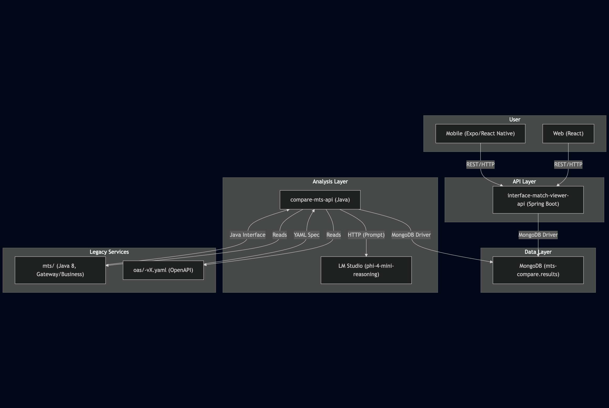

# API Comparison Platform

This project provides a full-stack solution for comparing legacy Java 8 service interfaces with OpenAPI (OAS) specifications using GenAI, and visualizing the results via web and mobile apps.

---

## Architecture Diagram



---

## Project Structure

- `mts/` — Legacy Java 8 services (Gateway/Business layers)
- `oas/` — OpenAPI YAML specs (multiple versions per service)
- `compare-mts-api/` — Java app to compare interfaces and OAS using GenAI
- `interface-match-viewer-api/` — Spring Boot REST API for results
- `interface-match-viewer/` — React web frontend
- `interface-match-expo/` — Expo/React Native mobile frontend

---

## How to Run Locally

### 1. Prerequisites
- Java 8+ (for legacy services, compare-mts-api)
- Java 17+ (for Spring Boot API)
- Node.js 18+ and npm (for web/mobile frontends)
- MongoDB (running locally on `127.0.0.1:27017`)
- [LM Studio](https://lmstudio.ai/) with `microsoft/phi-4-mini-reasoning` model running at `http://localhost:1234/v1/chat/completions`

### 2. Start MongoDB
```
# If not already running
mongod --dbpath <your_db_path>
```

### 3. Run GenAI Model (LM Studio)
- Open LM Studio, load the `microsoft/phi-4-mini-reasoning` model, and start the server on port 1234.

### 4. Run Legacy Services (optional, for reference)
```
cd mts/<service>
mvn clean package
```

### 5. Run Comparison & Analysis
```
cd compare-mts-api
mvn clean package
mvn exec:java -Dexec.mainClass="com.example.compare.CompareMain"
```
- This will populate MongoDB with comparison results.

### 6. Run Spring Boot API
```
cd interface-match-viewer-api
mvn spring-boot:run
```
- API available at `http://localhost:8080/api/matches`

### 7. Run Web Frontend
```
cd interface-match-viewer
npm install
npm start
```
- App available at `http://localhost:3000`

### 8. Run Mobile (Expo) Frontend
```
cd interface-match-expo
npm install
npm run web # or npm start for Expo Go
```

---

## Dependencies

- **Java:**
  - Maven, OkHttp, Jackson, MongoDB Java Driver
- **Spring Boot:**
  - spring-boot-starter-web, spring-boot-starter-data-mongodb
- **Node.js:**
  - React, MUI, Expo, React Native Paper
- **MongoDB:**
  - Local instance, database: `mts-compare`, collection: `results`
- **GenAI:**
  - LM Studio, `microsoft/phi-4-mini-reasoning` model

---

## Design Notes
- **Legacy Java 8 services** are organized under `mts/` for modularity.
- **OAS specs** are versioned to allow similarity analytics.
- **compare-mts-api** orchestrates interface-vs-OAS comparison using GenAI and stores results in MongoDB.
- **interface-match-viewer-api** exposes results as a REST API.
- **Web and mobile frontends** fetch and visualize results.

---

## Contact
For questions or contributions, please open an issue or contact the maintainer. 